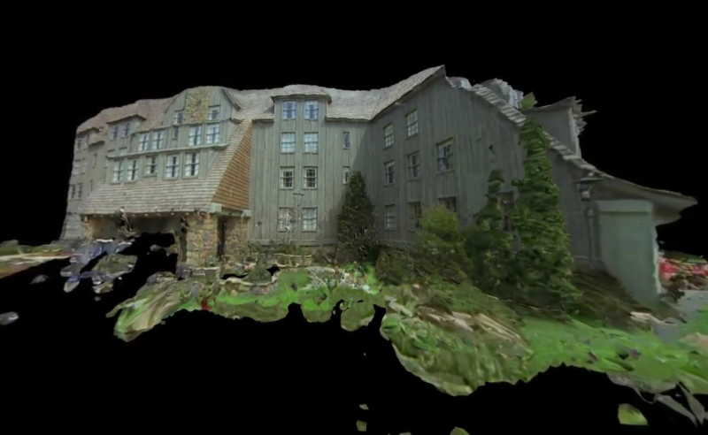

# Find your way out

"Shining 360" by [Claire Hentschker](http://www.clairesophie.com/)

 In the frame of the main topic of this semester ("Orientation, Navigation, Information/Intervention"), this course will focuses on creation of 3D spaces and on the construction of alternative paths to experience those spaces.

##### Table of Contents

[Terrain](#terrain)

[Labyrinth](#labyrinth)

[Point clouds](#point-clouds)

[3D scan of objects](#scan-obj)

[3D scan of ambients](#scan-ambients) 

[3D scanned model elaboration.](#elaboration)

[Space Navigation](#navigation)

<a name="#terrain"/>

## Terrain generation from noise texture

</a>

### Class activities:
- Add a perpendicular plane to the ground and use it for the sky. Apply a shader on it.
- Move the noise displacement in the GPU. Use this [function](https://www.shadertoy.com/view/4dS3Wd).
- Add texture splatting to your mountains. Google for "texture splatting height-map". Write your own implementation in the fragment shader, passing a texture as uniform. We will see the different results in class.

- How could you add a simple fog?
- Find another texture for the mountains.
- Set a gradient for the sky. Consult [the book of shaders](https://thebookofshaders.com/03/)

### Homework 
- Remove ofEasyCam and use ofCamera.
- Adjust height of the hills using the mouse position (use setUniform1f!).
- Bonus if you add a sun.
- Back to our original implementation, where the noise was written in a texture. Can you imagine to use an image that comes from a satellite instead of a noised image? some tips [here](https://medium.com/@zubazor/visualizing-a-mountain-using-three-js-landsat-and-srtm-26275c920e34)

<a name="#labyrinth"/>

## Maze

</a>

*“I imagined a labyrinth of labyrinths, a maze of mazes, a twisting, turning, ever-widening labyrinth that contained both past and future and somehow implied the stars. Absorbed in those illusory imaginings, I forgot that I was a pursued man; I felt myself, for an indefinite while, the abstract perceiver of the world. The vague, living countryside, the moon, the remains of the day did their work in me; so did the gently downward road, which forestalled all possibility of weariness. The evening was near, yet infinite.”*

- Jorge Luis Borges, Ficciones

### Resources/Inspiration:

- [Mondrian, Composition No. 10 Pier and Ocean, 1915](https://www.piet-mondrian.org/pier-and-ocean.jsp)
- [Picasso, minotauromacy](https://www.pablopicasso.org/minotauromachy.jsp)
- [Miro', Labyrinth](https://en.wikipedia.org/wiki/Labyrinth_(Mir%C3%B3,_Joan))
- [Keith Haring, labyrinth](http://www.artnet.com/artists/keith-haring/the-labyrinth-HxvzssEwmeRZAaIuE5yT5w2)
- [Maze generation algorithm](https://en.wikipedia.org/wiki/Maze_generation_algorithm)
- [Simple Path finding algorithm](https://en.wikipedia.org/wiki/Pathfinding#Sample_algorithm)
- [List of maze video games](https://en.wikipedia.org/wiki/List_of_maze_video_games)
- [Pac-man](https://en.wikipedia.org/wiki/Pac-Man)
- [2002, Super Mario Clouds](https://www.youtube.com/watch?v=fCmAD0TwGcQ)
- [The invisible shape of things past](https://artcom.de/en/project/the-invisible-shape-of-things-past/)

### Class activities:
- Build a 2D composition that recall a labyrinth OR
- Implement one of the algorithm explained [here](https://en.wikipedia.org/wiki/Maze_generation_algorithm) 

<a name="#point-clouds"/>

## Point clouds.

</a>

- Introduction to point clouds.
- Create and draw a point cloud in openFrameworks.

### Class activities:
-  Open `examples/3d/pointCloudExample`, remove `glEnable(GL_POINT_SMOOTH);`, `mesh.setMode(OF_PRIMITIVE_POINTS);`, `glEnable(GL_POINT_SMOOTH);` and see how this affect the result.
- Create a texture and a point cloud mesh using ofNoise. Apply the colors to your points, as in the example.

<a name="#scan-obj"/>

## 3D scan of objects.

</a>

* Introduction to photogrammetry
* How to use [metashape](https://www.agisoft.com/) and how to import your scanned object in other programs. These tutorials refers to Agisoft photoscan, the new version of this software is called metashape, it works more or less the same. The following tutorials comes from [Golan Levin's course](https://github.com/golanlevin/ExperimentalCapture/)
	* Alex Porter's Tutorial: Capturing with Photoscan](https://vimeo.com/123701711)
	* *Optional viewing*: Alex Porter's Tutorial for [Alex Porter's Tutorial: Cleaning Photoscans](https://vimeo.com/123702711)
	* [Michelle's tutorial](https://github.com/golanlevin/ExperimentalCapture/blob/master/students/michelle/tutorial2.md) for using PhotoScan
	* [Claire's tutorial](https://github.com/golanlevin/ExperimentalCapture/blob/master/workshop/pdf/photogrammetry_from_video_with_photoscan.pdf) for PhotoScan from video frames.
	* [scanning of the bottom part of an object](https://www.agisoft.com/index.php?id=49)

### Resources/Inspiration:
- [A brief history of photogrammetry, By Golan Levin](https://github.com/golanlevin/ExperimentalCapture/blob/master/docs/Photogrammetry-and-3D-scanning.md)
- [Slit Scan Turntable by Convivial](https://www.instructables.com/id/Slit-Scan-Turntable/)
- [Clouds, James George & Jonathan Minard](https://medium.com/volumetric-filmmaking/spatialstorytelling-fa4b6ace3e16)

<a name="#scan-ambients"/>

## 3D scan of external ambients.

</a>
- How to scan an external ambient using a photocamera.
- How to get a 3D model from a file video

### Resources/Inspiration:
- [Shining 360 by Claire Hentschker](http://www.clairesophie.com/shining360excerpt)

### Class activities:
- Organize a navigation path inside a 3D scanned space.

<a name="#elaboration"/>

## 3D scanned model elaboration.

</a>

- Apply shaders to the model.
- From points to 3D surfaces using [MeshLab](https://en.wikipedia.org/wiki/MeshLab)
- Mesh deformation using vertex shaders.
- Video recording.

<a name="#navigation"/>

## Space navigation.

</a>

- Camera movements inside 3D spaces.
- Possible interactions.
- Multiple views, camera parenting, camera on a 3D path.

### Resources/Inspiration
- All the examples in your OF installation inside `examples/3d` that have the name that include the word "Camera".
- [Moving Cameras and Point of View by Golan Levin](https://github.com/golanlevin/ExperimentalCapture/blob/master/docs/moving-cameras.md)

- [Tezuka Osamu, 1984](https://www.youtube.com/watch?v=_1pThwh2Ves)
- [Firewatch](https://www.firewatchgame.com/)
- [Walking Simulator, definition](https://tvtropes.org/pmwiki/pmwiki.php/Main/EnvironmentalNarrativeGame?from=Main.WalkingSimulator)
- [History of Walking Simulator](https://www.youtube.com/watch?time_continue=2&v=iDjkWxYD298)
- [History of Walking Simulator 2]((https://www.salon.com/2017/11/11/a-brief-history-of-the-walking-simulator-gamings-most-detested-genre/)
- [Ian MacLarty, Forests are for Trees](https://ianmaclarty.itch.io/forests-are-for-trees)
- [Ian MacLarty, The Catacombs of Solaris](https://ianmaclarty.itch.io/catacombs-of-solaris)
- [Ian MacLarty, SouthBank Portrait](https://ianmaclarty.itch.io/southbank-portrait)
- [Ian MacLarty, Black Hole Interior Explorer](https://ianmaclarty.itch.io/black-hole-interior-explorer)

- [Julius Von Bismarck, topshot helmet](http://juliusvonbismarck.com/bank/index.php?/projects/topshot-helmet/)
- [WORLD4](https://alexandermuscat.itch.io/world4)

### Class activities:
- Make a 3D space that you can navigate using the WASD keys. 
- Play one of the MacLarty's game. Find online a game where navigation per se is the core component of the game.

